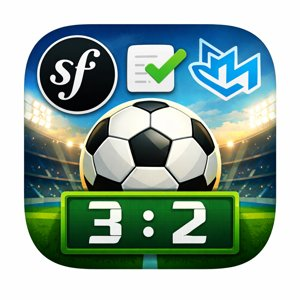

# Fullstack Demo: React 19 + Symfony 8 + MySQL 8


[](https://codecov.io/github/makomweb/fullstack-symfony-react)


## Purpose

A modern, full-stack, cloud-native game results tracker built on [Event Sourcing](https://martinfowler.com/eaaDev/EventSourcing.html) and [DDD principles](https://www.domainlanguage.com/ddd/).\
Track and analyze game results using an immutable event log with comprehensive 
monitoring and observability.

<p align="center">
  
</p>

### Tech Stack
| Layer | Technology |
|-------|-----------|
| Frontend (modern) | React 19 + MUI |
| Frontend (legacy) | Symfony 8 + TWIG + Bootstrap
| Backend | PHP 8.4 + Symfony 8 |
| Database | MySQL 8 |
| DevOps | Docker, Kubernetes, Helm, Open Telemetry, Grafana |

### Architecture Highlights
- **Event Sourcing** – All state changes stored as immutable events
- **Domain-Driven Design (DDD)** – Organized into generic, core, and supporting domains (enforced by [deptrac](https://github.com/deptrac/deptrac))
- **Full Test Coverage** – Easy to achieve high coverage on the core domain
- **Observable** – Built-in OpenTelemetry instrumentation with Grafana dashboard
- **Cloud-Ready** – Deployable to Kubernetes with included Helm charts

## System Architecture

```
┌──────────────────────────────────────────────────────────────────────────┐
│                           Client Layer                                   │
├──────────────────────────────────────────────────────────────────────────┤
│                                                                          │
│  ┌──────────────────┐  ┌──────────────────┐  ┌──────────────────┐        │
│  │   React UI       │  │   Legacy UI      │  │   Login Form     │        │
│  │  (Modern SPA)    │  │  (TWIG / Game)   │  │  (TWIG Template) │        │
│  │  Port 5173       │  │  Port 8080       │  │  Port 8080       │        │
│  │  (dev via Vite)  │  │  (via SpaCtrl)   │  │  (via Backend)   │        │
│  └────────┬─────────┘  └────────┬─────────┘  └────────┬─────────┘        │
│           │                     │                     │                  │
└───────────┼─────────────────────┼─────────────────────┼──────────────────┘
            │                     │                     │
            └─────────────────────┴─────────┬───────────┘
                                            │
┌───────────────────────────────────────────▼────────────────────────────────┐
│                      Backend (Port 8080)                                   │
├────────────────────────────────────────────────────────────────────────────┤
│                                                                            │
│  ┌──────────────────────────────────────────────────────────────┐          │
│  │  PHP 8.4 + Symfony 8 Application                             │          │
│  │  - SpaController (React app for authenticated users)         │          │
│  │  - Game Routes (Legacy UI endpoints)                         │          │
│  │  - REST API Endpoints                                        │          │
│  │  - Business Logic & Event Sourcing                           │          │
│  │  - Session-based Authentication                              │          │
│  └────────┬──────────────────┬─────────────┬────────────────────┘          │
│           │                  │             │                               │
└───────────┼──────────────────┼─────────────┼───────────────────────────────┘
            │                  │             │
    ┌───────▼──────┐   ┌───────▼───────┐  ┌──▼─────────────┐
    │              │   │               │  │                │
    │   Database   │   │  Redis Cache  │  │ Message Queue  │
    │   MySQL 8    │   │               │  │ (Messenger)    │
    │   Port 3306  │   │   Port 6379   │  │                │
    │              │   │               │  │                │
    │   Events &   │   │  - Sessions   │  │ - Async Tasks  │
    │   Data       │   │  - Cache      │  │ - Background   │
    └──────────────┘   └───────────────┘  └────────────────┘
```

## Prerequisites

- [Make](https://www.gnu.org/software/make/)
- [Docker](https://www.docker.com/)
- [Docker Compose](https://docs.docker.com/compose/)
- (Optional) [Kubernetes](https://kubernetes.io/)

See the [features](FEATURES.md) page for a complete list.

## Getting Started

**Quick Start (5 minutes):**

```sh
make dev      # Build development images
make init     # Setup DB, schema & fixtures
make up       # Start all services
make open     # Open dashboard in browser
```

**What's running?** 
- Backend API at [http://localhost:8080](http://localhost:8080)
- React UI at [http://localhost:5173](http://localhost:5173)
- Monitoring at [http://localhost:3000](http://localhost:3000)

**Stop everything:**
```sh
make down
```

**For all available commands**, run `make help` or see the [Makefile](./Makefile).

## Services & Access Points

**Frontend**
| Service | URL |
|---------|-----|
| Login Form | [http://localhost:8080/login](http://localhost:8080/login) |
| Legacy App | [http://localhost:8080/game/index](http://localhost:8080/game/index) |
| React App (dev with HMR) | [http://localhost:5173](http://localhost:5173) |
| React App (production build) | [http://localhost:8080/spa](http://localhost:8080/spa) |

**Backend & API**
| Service | URL | Credentials |
|---------|-----|-------------|
| API | [http://localhost:8080/api/games](http://localhost:8080/api/games) | — |
| API Docs | [http://localhost:8080/api/doc](http://localhost:8080/api/doc) | — |
| Admin UI | [http://localhost:8080/admin](http://localhost:8080/admin) | admin@example.com:secret |

**Monitoring & Observability**
| Service | URL |
|---------|-----|
| Grafana Dashboard | [http://localhost:3000](http://localhost:3000) |

**Data & Infrastructure**
| Service | URL | Credentials |
|---------|-----|-------------|
| Database (Adminer UI) | [http://localhost:8085](http://localhost:8085) | root:secret |
| Redis Cache UI | [http://localhost:5540](http://localhost:5540) | — |
| RabbitMQ Management | [http://localhost:15672](http://localhost:15672) | guest:guest |
| OpenTelemetry Collector | localhost:4317 (gRPC), localhost:4318 (HTTP) | — |
| Documentation | [http://localhost:8005](http://localhost:8005) | — |

## Quality Assurance & Development

**Testing**
```sh
make backend-test    # Run backend tests
make frontend-test   # Run frontend tests
```

**Code Quality**
```sh
make qa              # Full QA suite (tests + analysis)
make sa              # Static analysis
make cs              # Auto-fix code style issues
```

**Utilities**
```sh
make shell           # Shell access to PHP container
                     # Then run: php phploc.phar src/ (lines of code)
```

**All commands:** Run `make help` or see the [Makefile](./Makefile).

## Kubernetes Deployment

**Install with Helm:**

```sh
# Install all services with single unified chart
helm install myapp ./helm \
  -n myapp-ns \
  --create-namespace

# Verify deployment
kubectl get pods -n myapp-ns
```

**Access Services**
| Service | Access |
|---------|--------|
| Web App | http://localhost:30080 |
| Grafana | http://localhost:30300 |
| Database | Inside cluster: `db:3306` |
| Redis | Inside cluster: `cache:6379` |
| RabbitMQ | Inside cluster: `rabbitmq:5672`, Management: http://localhost:15672 |

See [helm/README.md](./helm/README.md) for configuration and production deployment guide.

## Learning & References

**Architecture & Patterns**
- [Event Sourcing](https://martinfowler.com/eaaDev/EventSourcing.html) – Design pattern reference
- [Domain-Driven Design](https://www.domainlanguage.com/ddd/) – DDD principles
- [Symfony Messenger worker on Kubernetes](https://itnext.io/symfony-messenger-worker-on-kubernetes-77f75725b5ed)

**Observability**
- [OpenTelemetry](https://opentelemetry.io/docs/what-is-opentelemetry/) – Instrumentation fundamentals
- [Grafana LGTM Stack](https://grafana.com/go/webinar/getting-started-with-grafana-lgtm-stack/) – Logs, traces, metrics, profiles

**Examples**
- [Symfony Messenger Example](https://github.com/nielsvandermolen/example-symfony-messenger/blob/master/Dockerfile-php-consume)
