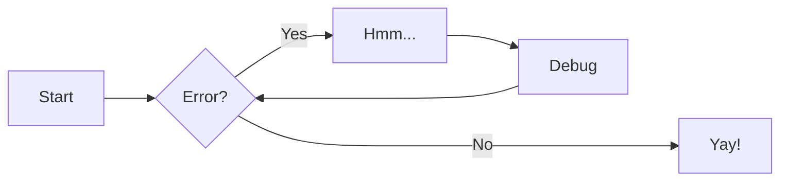

# Context and scope

## Business Context

**<Diagram or Table\>**

**<optionally: Explanation of external domain interfaces\>**

## Technical Context

**<Diagram or Table\>**

**<optionally: Explanation of technical interfaces\>**

**<Mapping Input/Output to Channels\>**